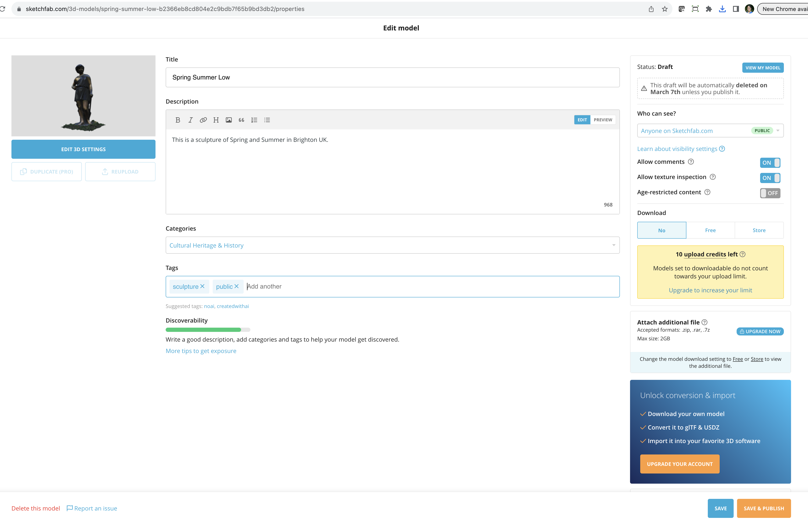
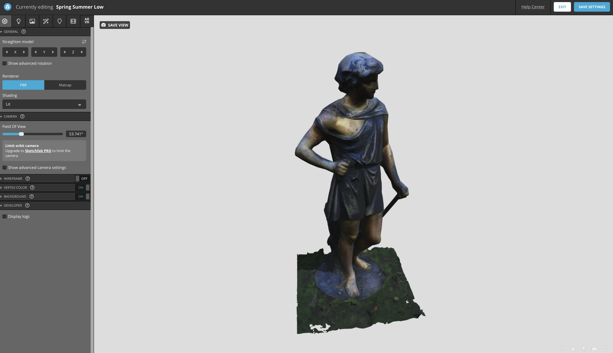

[Sketchfab](https://sketchfab.com/) is a popular tool for sharing and embedding 3D models. 

It offers the 3D model creator the ability to:

- Upload 3D files;
- Manage navigation and views;
- Edit the model's orientation and lighting;
- Add annotations to the model;
- Add simple metadata;
- Publish the model online.

### Upload 3D files

To upload a 3D file, you need to first create an account. This will allow
to upload a 3D model. Login to your account, and click on the *upload* button.

Please note that Sketchfab allows to upload a file up to 100MB. Hence, you need
to ensure the resolution is lowered in your file.

The software will allow to open your files. Sketchfab supports formats, including FBX, OBJ, DAE, BLEND, STL and you can also upload an archive like ZIP, RAR, or 7z, containing your textures, materials, and mesh.

If using textures which are available in separate files, 
it is recommended to zip your files together to simplify the upload process.

Sketchfab allows you to input basic metadata, including:

- Title
- Description
- Categories, which is best to use "Cultural Heritage and History"
- Tags
- Who can see the 3D model giving options such as public, private or password protected
- Whether to allow comments on this model
- Whether to allow texture inspection
- Whether it is age-restricted 
- Whether people can download the 3D model

Note that Sketchfab has an upload limit for 3D models that cannot be downloaded.

To edit the settings of the 3D model, click on *Edit 3D Settings*. This interface allows you to edit settings including:

- Scene settings, such as the 3D model position, its shading, and the camera field of view.
- Lighting settings.
- Material settings.
- Apply post-processing filters.
- Annotations and animations
- Scale the 3D model (specially useful for VR/XR viewing).

:::::::::::::::::: challenge

Open an account on Sketchfab if you do not already have one, and upload your
3D model.

Add metadata and adjust the various settings for viewing your 3D model.

:::::::::::::::::: 

### Annotations

Annotations support navigating the 3D models and looking at interesting details.

To add annotations to your 3D model, select *annotations* on the edit settings menu. For each annotation:

1. Orbit around the 3D model using the mouse until you find the position you want to annotate. You can zoom into the model if needed.
2. Double click in the 3D model.
3. This will create a *pinned number* on your 3D model, and a window will appear for you to input a *title*
and *description*. The description can be input in text format. But the annotations support a wider range
of data types if you are skilled in using [Markdown](https://www.markdownguide.org/).

Click on *Save Settings*. Your annotations will be saved.

<iframe title="Spring Summer Low" width="100%" height="350" frameborder="0" allowfullscreen mozallowfullscreen="true" webkitallowfullscreen="true" allow="autoplay; fullscreen; xr-spatial-tracking" xr-spatial-tracking execution-while-out-of-viewport execution-while-not-rendered web-share src="https://sketchfab.com/models/b2366eb8cd804e2c9bdb7f65b9bd3db2/embed"> </iframe> 
 <a href="https://sketchfab.com/3d-models/spring-summer-low-b2366eb8cd804e2c9bdb7f65b9bd3db2?utm_medium=embed&utm_campaign=share-popup&utm_content=b2366eb8cd804e2c9bdb7f65b9bd3db2" target="_blank" rel="nofollow" style="font-weight: bold; color: #1CAAD9;"> Spring Summer Low </a> by <a href="https://sketchfab.com/culturedigitalskills?utm_medium=embed&utm_campaign=share-popup&utm_content=b2366eb8cd804e2c9bdb7f65b9bd3db2" target="_blank" rel="nofollow" style="font-weight: bold; color: #1CAAD9;"> culturedigitalskills </a> on <a href="https://sketchfab.com?utm_medium=embed&utm_campaign=share-popup&utm_content=b2366eb8cd804e2c9bdb7f65b9bd3db2" target="_blank" rel="nofollow" style="font-weight: bold; color: #1CAAD9;">Sketchfab</a>

:::::::::::::::::: challenge

Create a few annotations on the 3D model you have uploaded highlighting important aspects.

:::::::::::::::::: 

